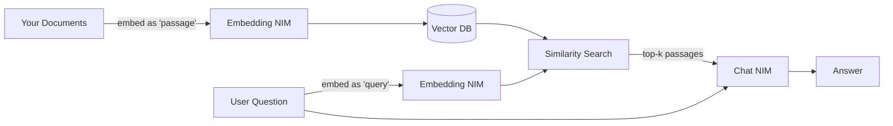

# Hosted-NIM-API — Step 2 of the NVIDIA NIM learning path

Small, self-contained Python scripts that call the **hosted** NVIDIA NIM
endpoint at `https://integrate.api.nvidia.com/v1`. No Docker, no GPU —
you just need a free NVIDIA developer API key.

## Setup (once)

```bash
# 1. Rotate / create an API key at https://build.nvidia.com  (Account -> API Keys)
# 2. Copy the template and paste your key:
cp Hosted-NIM-API/.env.example Hosted-NIM-API/.env
$EDITOR Hosted-NIM-API/.env

# 3. The venv + deps are already installed at the repo root:
../.venv/bin/python --version
```

## Files, in the order to read/run them

| # | File | What you learn |
|---|---|---|
| 00 | [smoke-test-key.py](smoke-test-key.py) | Confirm your key + `base_url` work. Prints token usage. |
| 01 | [01-raw-http-request.py](01-raw-http-request.py) | What NIM's HTTP request/response really look like, including SSE streaming. |
| 02 | [02-openai-sdk-basic.py](02-openai-sdk-basic.py) | Same call in ~20 lines with the OpenAI SDK. The "drop-in" story. |
| 03 | [03-openai-sdk-streaming.py](03-openai-sdk-streaming.py) | Token-by-token streaming, with TTFT + wall-time measurement. |
| 04 | [04-langchain-chat-nvidia.py](04-langchain-chat-nvidia.py) | `ChatNVIDIA` as a LangChain ChatModel — invoke + stream. |
| 05 | [05-embeddings.py](05-embeddings.py) | An embedding NIM + cosine similarity. Foundation for RAG. |
| 05.1 | [05.1-topk-retrieval.py](05.1-topk-retrieval.py) | Write a 1-file vector database: `retrieve_topk` on a larger corpus, two queries, why runners-up matter. |
| 05.2 | [05.2-batching-latency.py](05.2-batching-latency.py) | Sequential vs batched embedding calls + a batch-size sweep. Learn the difference between **latency** and **throughput** and find the sweet spot (usually batch 64–128). |
| 05.3 | [05.3-nn-visualization.py](05.3-nn-visualization.py) | See the embedding space: PCA-project 1024-D vectors to 2D, plot passages + queries, save `embed_scatter.png`. The exact debugging workflow used for real RAG. |
| 06 | [06-vision-multimodal.py](06-vision-multimodal.py) | Sending an image URL to a VLM NIM. |

### Extra deps used by the 05.x exploration scripts

`05.3` needs `matplotlib`, `scikit-learn`, and `numpy`. Already listed in [requirements.txt](requirements.txt); reinstall with:

```bash
../.venv/bin/pip install -r requirements.txt
```

## Run any script

```bash
cd /home/anjali/Downloads/AgenticIQ_ai/NVDIA-NIM
./.venv/bin/python Hosted-NIM-API/smoke-test-key.py
./.venv/bin/python Hosted-NIM-API/01-raw-http-request.py
# ...etc
```

## Concepts covered (Step 2 checklist)

- [ ] Base URL + model naming (`vendor/model-id`)
- [ ] API key hygiene (env var, never in source)
- [ ] OpenAI-compatible schema (chat, streaming, embeddings, vision)
- [ ] Raw SSE vs SDK-managed streaming
- [ ] LangChain integration path
- [ ] Query vs passage embeddings + cosine similarity
- [ ] Top-k retrieval — the whole vector-DB idea in one function *(05.1)*
- [ ] Batching, latency vs throughput, the sweet-spot batch size *(05.2)*
- [ ] Visual debugging with PCA projection *(05.3)*
- [ ] Multimodal message parts (`type: image_url`)

## Not in Step 2 (comes later)

- Step 3 — Run a NIM container locally on your GPU with `docker run`.
- Step 4 — Build a RAG app (embeddings NIM + vector DB + rerank NIM + chat NIM).
- Step 5 — Kubernetes deployment via the NIM Operator + Helm.
- Step 6 — Domain NIMs: Riva (speech), BioNeMo (science), more VLMs.

## 02-openai-sdk-basic.py notes


| Term | What it is | Related to |
|---|---|---|
| **OpenAI schema** | The specific request/response shape of **OpenAI's Chat Completions API** | NIM lessons — this is what I've been saying |
| **OpenAPI** (formerly Swagger) | A generic **language for describing any REST API** — a spec format | Documentation tooling |

Let me unpack both, because you'll see both in the wild.

---

### 1. "OpenAI schema" (the one relevant to our NIM lessons)

When I say *"NIM is OpenAI-compatible"* or *"it uses the OpenAI schema"*, I mean:
**NIM's HTTP endpoints accept the exact same JSON shape as OpenAI's endpoints, and return the exact same JSON shape back.**

### The request shape (what YOU send)

```json
POST /v1/chat/completions
{
  "model": "meta/llama-3.1-8b-instruct",
  "messages": [
    {"role": "system", "content": "You are helpful."},
    {"role": "user",   "content": "Hi"}
  ],
  "temperature": 0.2,
  "max_tokens": 256,
  "stream": false
}
```

### The response shape (what you GET back)

```json
{
  "id": "chatcmpl-...",
  "object": "chat.completion",
  "model": "...",
  "choices": [{ "message": {"role": "assistant", "content": "..."}, "finish_reason": "stop" }],
  "usage": { "prompt_tokens": 12, "completion_tokens": 34, "total_tokens": 46 }
}
```

**That structure — with those exact field names — is the "OpenAI schema."**

### Why this matters for NIM

Because NIM speaks it too:

- Endpoints match: `/v1/chat/completions`, `/v1/embeddings`, `/v1/models`.
- Field names match: `messages`, `role`, `content`, `choices`, `usage`.
- Streaming format matches: Server-Sent Events with `data: {...}` and `data: [DONE]`.

That's why in Lesson 02 you were able to write:

```python
from openai import OpenAI   # <-- OpenAI's own SDK

client = OpenAI(
    base_url="https://integrate.api.nvidia.com/v1",   # point at NIM
    api_key=nvidia_key,
)
resp = client.chat.completions.create(...)            # same code as if it were OpenAI
```

The OpenAI SDK doesn't know or care it's talking to NIM. It just formats requests in "the OpenAI schema" and expects responses in "the OpenAI schema." NIM plays along.

### Other providers that speak the same schema

Because so many providers have adopted this shape, one SDK works against all of them:
- OpenAI (obviously)
- Azure OpenAI
- Groq
- Together AI
- Anthropic (via a compat proxy)
- vLLM (when run with the OpenAI server entrypoint)
- Ollama
- **NIM** 

**Practical takeaway:** learn this schema *once*, use it *everywhere*.

---

### 2. "OpenAPI" — the different thing (bonus knowledge)

**OpenAPI** (one letter different, one word) is a specification format for describing **any** REST API — it has nothing specifically to do with OpenAI the company.

It's a YAML/JSON file that says things like:
```yaml
paths:
  /users/{id}:
    get:
      parameters:
        - name: id
          in: path
          schema: { type: integer }
      responses:
        '200':
          description: A user
          content:
            application/json:
              schema:
                $ref: '#/components/schemas/User'
```

You write this **once**, and tools like Swagger UI auto-generate docs, client SDKs, and mock servers from it. It's the industry-standard way to document REST APIs, regardless of who built them.

### The (annoying) intersection

NIM itself publishes an **OpenAPI document** describing its endpoints. Visit any running NIM at `/docs` (Swagger UI) or `/openapi.json` and you'll see an OpenAPI spec that formally describes the OpenAI-schema endpoints. So NIM uses OpenAPI *to document* the OpenAI schema. 🙃

---

### Quick memory aid

- **OpenAI schema** → *WHAT the JSON looks like* (specific field names invented by OpenAI).
- **OpenAPI spec** → *HOW to describe any REST API* (a format, not a specific API).

In every sentence I've written about NIM being "compatible", I meant **OpenAI schema** (the first one).


## 04-langchain-chat-nvdia.py notes

# Lesson 04 recap + Lesson 05 setup

You already ran `04-langchain-chat-nvidia.py` — exit code 0. Let me explain what you just saw, then walk you into 05.

---

## Lesson 04 — What LangChain gives you over the raw SDK

### The core idea: NIM as a **ChatModel** object

`ChatNVIDIA` is a wrapper that presents NIM as a **standardized LangChain interface**. Every provider (OpenAI, Anthropic, NIM, Ollama, Bedrock) implements the same `ChatModel` interface. Once you use LangChain, you can swap providers with **one line of code**.

```python
# NIM
llm = ChatNVIDIA(model="meta/llama-3.1-8b-instruct")

# OpenAI
llm = ChatOpenAI(model="gpt-4o-mini")

# Anthropic
llm = ChatAnthropic(model="claude-3-5-sonnet")

# All three respond to .invoke() and .stream() identically.
```

### Three things you get "for free" the moment a model is a ChatModel

**1. Typed messages** instead of dicts:
```python
from langchain_core.messages import SystemMessage, HumanMessage, AIMessage

messages = [
    SystemMessage(content="You are helpful."),
    HumanMessage(content="Hi"),
]
result = llm.invoke(messages)   # returns AIMessage
```
Static typing catches typos like `"rle": "user"` at write-time.

**2. Composition with LCEL (LangChain Expression Language) — the `|` operator:**
```python
from langchain_core.prompts import ChatPromptTemplate
from langchain_core.output_parsers import JsonOutputParser

prompt = ChatPromptTemplate.from_template("List 3 pros of {topic} as a JSON array.")
chain = prompt | llm | JsonOutputParser()

chain.invoke({"topic": "NVIDIA NIM"})
# -> ["pro 1", "pro 2", "pro 3"]   (already parsed to a Python list!)
```
That `|` is the whole point of LangChain: prompt → model → parser → downstream logic, all as one pipeline.

**3. Ready-made features:**
- **Tool calling** (`llm.bind_tools([my_functions])`) — model decides when to invoke your Python functions.
- **Retries + timeouts** (`llm.with_retry()`).
- **Structured output** (`llm.with_structured_output(MyPydanticModel)`) — model output auto-parsed into Pydantic.
- **Memory / conversation history** helpers.
- **LangGraph agents** built on top of the same `ChatModel`.

### The `reasoning_content` block in the file

I put this in the code:
```python
if "reasoning_content" in extra and extra["reasoning_content"]:
    print(extra["reasoning_content"], end="")
```
For **Llama 3.1 8B**, this is always empty (that model doesn't emit reasoning). But if you flip `MODEL = "nvidia/llama-3.1-nemotron-70b-instruct"` (a "thinking" model), this field starts showing you the model's *chain-of-thought* separately from its final answer. Nice to know for later.

### When to reach for LangChain vs raw OpenAI SDK

| Situation | Use |
|---|---|
| Simple app, one model, one call | **Raw OpenAI SDK** (Lessons 02–03) |
| Multi-step chain: prompt → model → parse → next step | **LangChain** |
| You want to swap providers freely | **LangChain** |
| Agent with tools / retrieval / memory | **LangChain / LangGraph** |
| Absolute minimum latency & dependencies | **Raw SDK** |

Rule of thumb: prototype in raw SDK, graduate to LangChain when the wiring starts to hurt.

---

## Lesson 05 — Embeddings (the RAG foundation)

Time to shift gears. Chat models make text. **Embedding models turn text into numbers** — specifically, a fixed-length list of floats called a **dense vector**.

### What is an embedding?

Any text → a vector like `[0.021, -0.153, 0.847, ..., 0.011]` (1024 numbers for `nv-embedqa-e5-v5`).

The magic: **semantically similar texts get similar vectors.** So you can measure "how related are these two sentences?" by computing a distance between their vectors.

```
"How do I deploy LLMs on GPUs?"    ->  vector A
"NVIDIA NIM makes LLM serving easy" ->  vector B   (very close to A)
"The Eiffel Tower is in Paris"     ->  vector C   (far from A and B)
```

### Cosine similarity — the standard distance

The math:  
$$
\text{cosine}(a, b) = \frac{a \cdot b}{\|a\| \cdot \|b\|}
$$

- Returns a number in **[-1, 1]**.
- **1.0** = identical direction (nearly identical meaning).
- **0.0** = unrelated.
- **-1.0** = opposite meaning (rare with modern embeddings).

Our lesson script implements this in ~4 lines of pure Python so you can *see* the formula.

### Query vs Passage — why NVIDIA cares

`nv-embedqa-e5-v5` is a **question-answering** embedding model. It takes a hint about what you're embedding:

- `input_type="passage"` → "this is a document to STORE in a database"
- `input_type="query"` → "this is a USER QUESTION searching the database"

These two produce **slightly different vectors** on purpose. Under the hood, the model was trained with two objectives so that a *question* vector lands near its *answer document* vector. If you accidentally embed everything as `passage`, retrieval quality drops measurably. This is a real-world footgun — worth internalizing now.

### The pipeline you're about to build in Step 4 (RAG)



Lesson 05 is the **first two nodes** of this diagram. Step 4 will add the vector DB and rerank NIM.

---

## Run it

```bash
python Hosted-NIM-API/05-embeddings.py
```

## What you should see

```
embedding dim : 1024
query         : How do I deploy LLMs efficiently on GPUs?

ranked passages (higher = more relevant):
  +0.7xxx   NVIDIA NIM packages optimized inference microservices as Docker containers.
  +0.6xxx   TensorRT-LLM optimizes large language models for NVIDIA GPUs.
  +0.2xxx   The Eiffel Tower is a wrought-iron lattice tower in Paris, France.
```

**What to notice:**
- `embedding dim: 1024` — each text became a 1024-number vector.
- The two NIM/TensorRT sentences beat the Eiffel Tower one by a **wide margin** (~0.5+). That's the model correctly recognizing topical relevance without ever being told what NIM or the Eiffel Tower are — it learned that from its training corpus.
- The magnitude of the gap between "related" and "unrelated" is what makes vector search work.

## Learning exercises for Lesson 05

**A. Break the query/passage rule.** Change both `input_type`s to `"passage"` and rerun. Compare scores. Usually the numbers shift enough to matter.

**B. Add a trap passage.** Add this string to the `passages` list:
```python
"Kubernetes is a container orchestration platform.",
```
It's related to *deployment* but not to *LLM inference*. Where does it rank? The model should place it between "Eiffel Tower" (irrelevant) and the two NIM/TensorRT lines (highly relevant). Great illustration of *graded* similarity.

**C. Try a paraphrase.** Add this passage:
```python
"To run big language models fast on graphics cards, use optimized serving.",
```
Notice it uses *none* of the words in the query ("deploy", "LLMs", "GPUs") but should still rank high. That's **semantic** search — the whole reason we don't just use keyword matching.

**D. Print the first 5 numbers of a vector** at the top of `main()` after the query embed:
```python
print("first 5 dims:", query_vec[:5])
```
Just to see it's a real list of floats.

