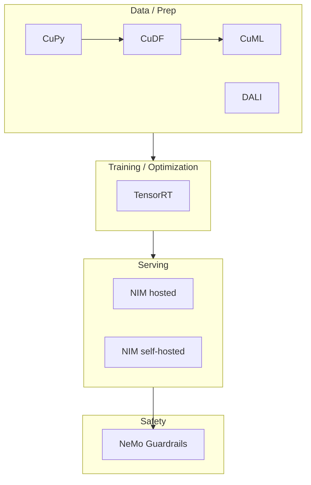

# NVIDIA NIM — Structured Study Guide

> Source: `NVIDIA NIM.pptx` (12 slides), reorganized, expanded, and cross-referenced for self-study.

---

## Table of Contents

1. [The Problem NIM Solves](#1-the-problem-nim-solves)
2. [What NVIDIA NIM Is](#2-what-nvidia-nim-is)
3. [How NIM Works — The Four Layers](#3-how-nim-works--the-four-layers)
4. [The Restaurant Analogy](#4-the-restaurant-analogy)
5. [Inside a NIM Container](#5-inside-a-nim-container)
6. [NIM vs Other AI Deployment Tools](#6-nim-vs-other-ai-deployment-tools)
7. [NIM vs vLLM — Side-by-Side](#7-nim-vs-vllm--side-by-side)
8. [System Requirements & Environment Check](#8-system-requirements--environment-check)
9. [The Wider NVIDIA GPU Library Ecosystem](#9-the-wider-nvidia-gpu-library-ecosystem)
10. [Quick Recap & Self-Check Questions](#10-quick-recap--self-check-questions)

---

## 1. The Problem NIM Solves

Deploying AI models is **harder than building AI applications**. Teams increasingly rely on LLMs, VLMs, and embedding models, but productionizing them requires substantial engineering.

**Common pain points:**

- Model downloading & version management
- GPU configuration (CUDA versions, drivers, container toolkit)
- Performance optimization (batching, KV-cache, quantization)
- Building & maintaining a REST API layer
- Scaling to multiple concurrent users
- Monitoring, logging, health checks
- Security and enterprise-grade support

**Central question:**
> *How can organizations deploy AI models in minutes instead of spending weeks building serving infrastructure?*

That is the exact gap NIM fills.

---

## 2. What NVIDIA NIM Is

**NVIDIA NIM** = **N**VIDIA **I**nference **M**icroservices.

A collection of **containerized AI inference microservices** that package optimized models and expose them through **standard REST APIs** (OpenAI-compatible).

Formula view:

```
AI Model + Inference Engine + REST API + GPU Optimizations + Docker Container = NVIDIA NIM
```

**Value proposition:**
NVIDIA handles the infrastructure & optimization; developers focus on business logic.

| Without NIM | With NIM |
|---|---|
| Weeks configuring CUDA, Triton, TensorRT | `docker run` and you're serving |
| Custom REST wrapper per model | Uniform OpenAI-compatible API |
| Manual perf tuning per GPU | Auto-selected optimized profile |

---

## 3. How NIM Works — The Four Layers

NIM is a stack of four cooperating components:

### 3.1 AI Model (The Brain)
The actual intelligence. Examples: **Llama 3, Mistral, Gemma, DeepSeek, CLIP**. Understands the prompt and generates the response.

### 3.2 TensorRT-LLM (The Performance Optimizer)
NVIDIA's engine that takes a trained LLM and makes it run **dramatically faster** on NVIDIA GPUs:

- Fused, faster matrix operations
- Better GPU memory usage (paged KV-cache)
- Lower latency, higher throughput
- Efficient attention (FlashAttention-style kernels)

Same answers — just faster and cheaper per token.

### 3.3 Triton Inference Server (The Manager)
The server layer that:

- Receives requests
- Sends them to the model
- Manages queues
- **Dynamically batches** requests
- Returns responses
- Monitors performance

### 3.4 CUDA Runtime (The Translator)
GPUs don't speak Python; they speak **CUDA**. CUDA converts high-level operations into GPU-executable instructions. Without CUDA, no GPU compute.


---

## 4. The Restaurant Analogy

A memorable mental model straight from the deck:

| Component | Restaurant Role | What It Does |
|---|---|---|
| **AI Model** | Chef | Actually cooks (generates the answer) |
| **TensorRT-LLM** | Professional kitchen equipment | Same chef, but drastically faster |
| **Triton Server** | Restaurant manager | Decides order priority, batches tables |
| **CUDA** | Translator | Chef speaks Japanese, customers speak English — CUDA bridges the two |

**Without NIM:** you buy ingredients, cook, clean, and serve.
**With NIM:** you place an order; the "restaurant" handles everything else.

---

## 5. Inside a NIM Container

Conceptual view of a `Llama 3 NIM` container:

```
┌───────────────────────────────────────────┐
│           NVIDIA NIM Container            │
│                                           │
│  Ubuntu Linux                             │
│  Python runtime                           │
│  CUDA runtime                             │
│  TensorRT-LLM                             │
│  Triton Inference Server                  │
│  OpenAI-compatible REST API               │
│                                           │
│  ── Support services ──                   │
│  Model configuration                      │
│  Model downloader                         │
│  Health checks                            │
│  Logging                                  │
│  Monitoring                               │
│  Security                                 │
└───────────────────────────────────────────┘
```

**Important detail:** the model weights are usually **not baked into the image** (they can be many GB). The container knows how to **download, cache, and configure** the model on first run, then reuses the cache for subsequent starts.

---

## 6. NIM vs Other AI Deployment Tools

| Feature | Hugging Face Transformers | Ollama | vLLM | Triton Inference Server | **NVIDIA NIM** |
|---|---|---|---|---|---|
| Primary Purpose | Develop & run models in Python | Local model execution | High-performance LLM serving | Production inference server | **Enterprise AI inference microservice** |
| Target Users | Developers & researchers | Individual devs | AI engineers | ML platform engineers | **Enterprise dev teams** |
| Model Deployment | Manual | Simple local | Manual server | Manual server | **Ready-to-deploy container** |
| Inference Optimization | Limited | Basic | Optimized | Optimized | **NVIDIA-optimized (TensorRT-LLM)** |
| REST API | Build your own | Built-in | OpenAI-compatible | Configurable | **OpenAI-compatible** |
| Concurrent Requests | Manual | Limited | Yes | Yes | **Yes** |
| Dynamic Batching | No | No | Yes | Yes | **Yes** |
| GPU Optimization | Manual | Basic | Good | Good | **Optimized for NVIDIA GPUs** |
| Scalability | Manual | Limited | Good | Excellent | **Enterprise-ready** |
| Enterprise Support | Community | Community | Community | NVIDIA | **NVIDIA** |
| Containerized | Optional | Yes | Yes | Yes | **Yes** |
| Best Use Case | Model dev | Local experiments | High-perf LLM serving | Multi-model platform | **Production enterprise AI** |

**Takeaway:** NIM = *Triton + TensorRT-LLM + OpenAI API + enterprise support*, packaged as one image.

---

## 7. NIM vs vLLM — Side-by-Side

### vLLM (you configure & operate)

```bash
pip install vllm
python -m vllm.entrypoints.openai.api_server \
    --model meta-llama/Meta-Llama-3-8B-Instruct \
    --tensor-parallel-size 2 \
    --gpu-memory-utilization 0.9 \
    --max-model-len 4096 \
    --port 8000
```

### NVIDIA NIM (packaged deployment)

```bash
docker run \
    --gpus all \
    -p 8000:8000 \
    nvcr.io/nim/meta/llama-3.1-8b-instruct
```

**Client code is nearly identical** (both expose OpenAI-compatible endpoints). The difference is *how the model is deployed, optimized, and managed*.

- **vLLM** = an inference engine you configure and operate.
- **NIM** = a packaged, enterprise-ready deployment built around NVIDIA's optimized inference stack, so you invest less in infrastructure and more in application logic.

---

## 8. System Requirements & Environment Check

Baseline pre-flight checklist for running NIM locally:

| Requirement | Typical Status | Action If Missing |
|---|---|---|
| NVIDIA GPU | Available | None |
| NVIDIA Driver | Installed | Install matching driver |
| CUDA Toolkit | Often missing | Install CUDA Toolkit or ensure `nvcc` is on PATH |
| Docker | Installed | Install Docker Engine |
| Docker running & user permissions | Verify | Add user to `docker` group |
| NVIDIA Container Toolkit | Verify | Install `nvidia-container-toolkit`, then `sudo nvidia-ctk runtime configure --runtime=docker` |
| System RAM | ≥ 32 GB recommended | Upgrade if low |
| Free SSD Space | 50–200 GB for model cache | Free disk |
| NGC Account & API Key | Required | Sign up at `ngc.nvidia.com`, create API key |

**Quick verification commands:**

```bash
nvidia-smi                              # Driver + GPU visible
nvcc --version                          # CUDA toolkit
docker --version                        # Docker installed
docker run --rm --gpus all nvidia/cuda:12.4.0-base-ubuntu22.04 nvidia-smi   # Container toolkit works
```

---

## 9. The Wider NVIDIA GPU Library Ecosystem

NIM lives inside a much larger NVIDIA acceleration stack. Knowing these makes you a stronger practitioner.

| Library | Utility | Replaces | Key Benefit |
|---|---|---|---|
| **CuPy** | GPU-accelerated array computing (NumPy API on CUDA) | NumPy | 10–100× on large FP32 matrix ops; near-zero learning curve |
| **RAPIDS cuDF** | GPU DataFrames (pandas API) | Pandas | 20–50× on joins/group-bys; zero-code-change via `python -m cudf.pandas` |
| **RAPIDS cuML** | GPU ML (scikit-learn API — KMeans, UMAP, PCA, DBSCAN) | scikit-learn | 10–50×; interactive iteration instead of batch waits |
| **TensorRT (torch-tensorrt)** | Compiles models to hardware-tuned engines (layer fusion, FP16/INT8, kernel auto-tuning) | Raw PyTorch serving | 2–5× lower latency; the same engine powers NIM internally |
| **NIM (hosted)** | Prepackaged optimized microservice — TensorRT-LLM inside, OpenAI API outside | Hand-rolled LLM serving; alt to vLLM | Zero optimization effort; auto-selects best engine per GPU; enterprise support |
| **NIM (self-hosted)** | Same NIM container on your own GPU | Cloud dependency | Full control, no network latency, data stays on-prem |
| **NeMo Guardrails** | Programmable input/output/dialog rails (Colang/YAML) | Prompt-only safety | Externally defined policies; model-agnostic (NIM/OpenAI/vLLM backends) |
| **DALI** | GPU-side data loading & augmentation (hardware JPEG decode) | torchvision transforms + CPU DataLoader | GPU util ~60% → 95%+; 30–50% faster epochs on image workloads |

**Mental map — where NIM sits:**



---

## 10. Quick Recap & Self-Check Questions

**Can you answer these in one sentence each?**

1. What does the acronym **NIM** stand for and what does a NIM package together?
2. Which component in the NIM stack is the *"chef"*, and which is the *"manager"*?
3. Why is **TensorRT-LLM** important even though the model itself is unchanged?
4. Name three things a NIM container includes besides the model.
5. In one line, how does **NIM differ from vLLM** in terms of developer effort?
6. What is the role of **CUDA** in the stack?
7. Why are model weights usually **not** baked into the container image?
8. Which two NVIDIA libraries would speed up your **pandas + scikit-learn** preprocessing pipeline?
9. What tool would you layer on top of NIM to enforce **input/output safety policies**?
10. What's the minimum you need on a Linux box before `docker run nvcr.io/nim/...` will work?

---

## Appendix — Deck-to-Section Map

| Slide | Title | Covered in Section |
|---|---|---|
| 1 | Title | — |
| 2 | The Current Challenge | 1 |
| 3 | What is NVIDIA NIM? | 2 |
| 4 | How NIM Works | 3 |
| 5 | Restaurant Analogy | 4 |
| 6 | NIM Container | 5 |
| 7 | NIM vs Existing Tech | 6 |
| 8 | NIM vs vLLM | 7 |
| 9 | Requirements | 8 |
| 10–11 | NVIDIA Libraries | 9 |
| 12 | Library Map | 9 |
